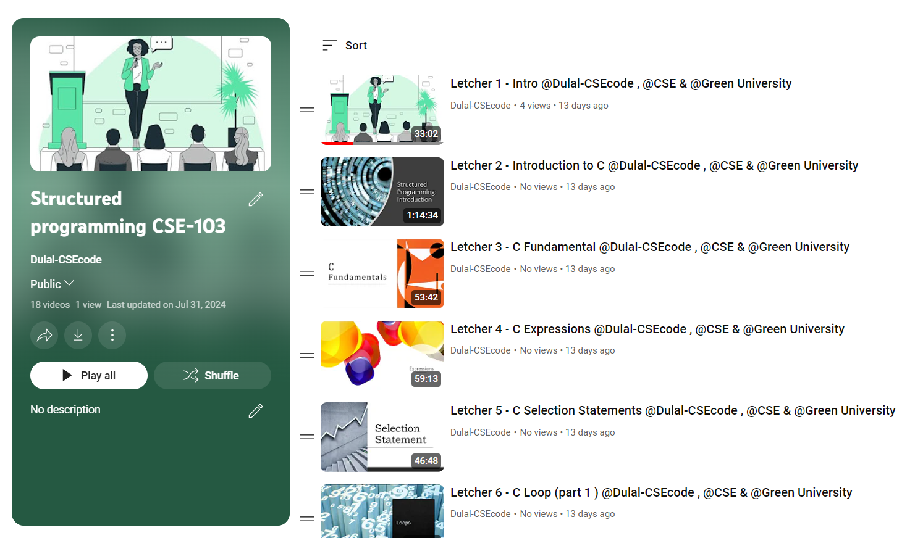

<h1 align="center">--- Structured-programming-CSE-103 ---</h1>  
<h3 align="center">-- Spring 2022 --</h3>  
<br />  
Welcome to the Structured Programming CSE-103 repository. This repository contains course materials, assignments, and resources for the Structured Programming course.  
<br />  



  
<br />  
<br />  
<br />  
Check out the playlist now and start your learning journey: [Structured-programming-CSE-103 Youtube Playlist Link : ](https://youtube.com/playlist?list=PLEc-WcPXUsjsm4_JTG3Pvc7wgva-cx3yQ&si=gipLEXV_A_A8tfdd)
**Happy Learning!**
<br />  
<br />  
<br />  
## Table of Contents
- [Introduction](#introduction)
- [Course Outline](#course-outline)
- [Installation](#installation)
- [Prerequisites](#prerequisites)
- [Assignments and Practice Problems](#assignments-and-practice-problems)
- [Usage](#usage)
- [Contributing](#contributing)
- [License](#license)

## Introduction

In this course, we will cover the fundamental concepts of structured programming, including logic, set theory, functions, mathematical induction, graph theory, and more. The repository provides a comprehensive guide to understanding and applying these principles through problem-solving.

## Course Outline

### 1. Socialization and Introduction to the Course
- Overview of course objectives and structure.
- Importance of C programming.
- Introduction to IDE and Compiler.

### 2. Writing a Simple C Program
- **Text:** 2.1, 2.2, 2.3, 2.4, 2.5
  - Suggested Problems: 1-5
  - General form of a simple program.
  - Comments, Variables & Assignments.
  - Input/Output operations.

### 3-4. Arithmetic and Assignment Operators
- **Text:** 4.1, 4.2, 4.3, 4.4
  - Suggested Problems: 1-6
  - Arithmetic operators, Assignment operators.
  - Increment/Decrement operators.
  - Expression evaluation.

### 5-6. Logical Expressions and Control Statements
- **Text:** 5.1, 5.2, 5.3
  - Suggested Problems: 1-10
  - Logical Expressions, The if statement.
  - The switch statement.

### 7-10. Loop Control Structures
- **Text:** 6.1, 6.2, 6.3, 6.4
  - Suggested Problems: 1-14
  - The while, do-while, and for statements.
  - Exiting from a loop.

### 11-12. Arrays
- **Text:** 8.1, 8.2
  - Suggested Problems: 1-8
  - One-dimensional and Multidimensional arrays.

### 13-15. Functions
- **Text:** 9.1 to 9.6, 22.2
  - Suggested Problems: 1-11
  - Defining and calling functions, Function declarations.
  - Arguments, Return statements, Program termination.
  - Recursion, File operations.

### 16-17. Strings
- **Text:** 13.1 to 13.6
  - Suggested Problems: 1-10
  - String literals, String variables, Reading and writing strings.
  - Accessing characters in a string, Using the C string library, Arrays of strings.

### 18-19. Structures
- **Text:** 16.1 to 16.3
  - Suggested Problems: 1-6
  - Structure variables, Structure types, Nested arrays & structures.

### 20-22. Pointers
- **Text:** 11.1 to 11.5, 12.1 to 12.4
  - Suggested Problems: 1-7 (11.1), 1-9 (12.1)
  - Pointer variables, The address and indirection operators, Pointer assignment.
  - Pointers as arguments, Pointer return values, Dynamic memory allocation.
  - Pointer arithmetic, Using pointers for array processing, Array names as pointers, Pointers & multidimensional arrays.

## Installation

To set up the environment:

1. Clone the repository:
   ```bash
   git clone https://github.com/Dulal-CSEcode/Structured-programming-CSE-103.git
   cd Structured-programming-CSE-103
    ```

2. Install any required packages or dependencies. For example, on a Debian-based system:

    ```bash
    sudo apt-get update
    sudo apt-get install build-essential
    ```
## Prerequisites

Before you begin, ensure you have met the following requirements:

- You have a basic understanding of programming concepts.
- You have access to a C/C++ compiler.
- You have a basic understanding of C/C++ programming.
- You have Git installed on your computer.

## Assignments and Practice Problems

This repository includes a collection of assignments and practice problems to help reinforce the concepts taught in the course. Each assignment is located in its respective directory with detailed instructions and resources.

## Usage
Navigate to the specific assignment or practice problem directory and follow the instructions provided in the README.md file located in each folder.

## Contributing
Contributions are welcome! To contribute, please follow these steps:

1. Fork the repository.

2. Create a new branch (e.g., feature-branch).

3. Make your changes and commit them (git commit -m 'Add new feature').

4. Push to the branch (git push origin feature-branch).

5. Create a pull request.

Please ensure your code follows the repository's coding standards and includes appropriate tests.

## License
This project is licensed under the MIT License. See the LICENSE file for more details.


<br/>
<h2 align="center"> Thanks for visiting the Structured-programming-CSE-103 repository.</h2>
<h3 align="center">© All rights reserved by Dulal-CSEcode @2024 © Department of Computer Science and Engineering, GUB </h3>


   
